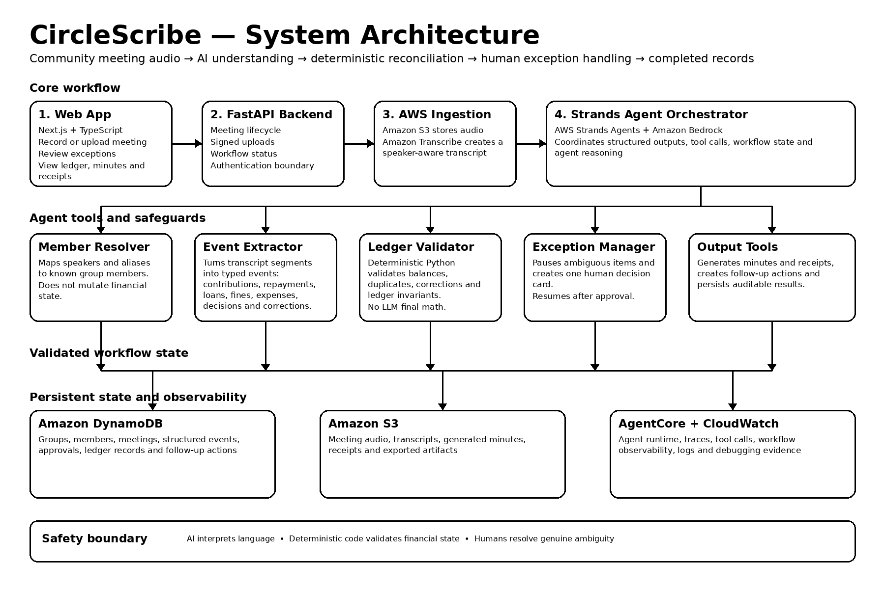

# CircleScribe

> **Turn community savings-group meetings into reconciled ledgers, receipts, minutes, and follow-ups — escalating only genuine ambiguity to a human.**

CircleScribe is an autonomous meeting secretary for community savings groups, built for the **AWS Agents for Humans Hackathon — Good Neighbor Agents track**.

## Core principle

> **AI interprets language. Deterministic code validates financial state. Humans resolve genuine ambiguity.**

CircleScribe deliberately does **not** let an LLM become the ledger.

## What it does

A meeting can contain:

```text
Amina: I paid fifty thousand for my savings contribution.
John: I paid thirty thousand.
Mary: I am repaying forty thousand on my loan.
Sarah: I would like to request a loan of one hundred thousand for one month.
John: Actually, correct my contribution. Make that twenty thousand, not thirty.
Chair: Noted. We will review Sarah's request before approving it.
```

CircleScribe turns that into:

- Amina contribution → **50,000 UGX**
- John contribution → **20,000 UGX**
- Mary's loan repayment → **40,000 UGX**
- John's earlier 30,000 UGX statement → **superseded**
- Sarah's 100,000 UGX loan request → **follow-up action, not ledger mutation**
- meeting minutes, receipts, audit evidence, and persistent history

If someone says `Maybe I paid fifty thousand, I am not sure`, CircleScribe blocks the financial mutation and asks a human to confirm or discard it. The same deterministic validator then runs again before the workflow can complete.

## Architecture



```text
Meeting audio / transcript
          ↓
 Amazon Transcribe
          ↓
   Strands Agent + Amazon Bedrock
          ↓
 typed MeetingExtraction
          ↓
 AI contract validation
          ↓
 deterministic ledger validator
       ↙                 ↘
   verified             ambiguous
      ↓                    ↓
receipts/minutes       human decision
 audit/follow-up            ↓
                      validator reruns
```

The production AI adapter uses **AWS Strands Agents** with Amazon Bedrock. The default model is `global.anthropic.claude-sonnet-4-6`.

## Current implementation

Working and tested:

- FastAPI backend and Next.js operator UI
- structured meeting-event schema
- correction supersession
- deterministic reconciliation
- unknown-member and currency rejection
- confidence-based human escalation
- loan requests kept outside the transaction ledger
- human confirm/discard workflow and validator rerun
- final artifact blocking while review remains
- receipts, minutes, follow-ups, audit trail, evidence bundle
- durable SQLite meeting history and reopen-after-restart behavior
- browser microphone recording and local MLX Whisper development transcription
- explicit Strands/Bedrock production adapter with contract validation
- AWS readiness diagnostics and real network smoke-test script
- automated backend safety/API integration tests
- GitHub Actions CI and production Next.js build verification

## AWS production path

The repository contains the real Strands + Bedrock production extraction adapter. At this README update, live AWS execution is temporarily blocked by an AWS account-verification review. The local fallback is clearly labeled and is **never represented as AWS inference**.

Once AWS access is restored:

```bash
export AWS_BEARER_TOKEN_BEDROCK='YOUR_BEDROCK_API_KEY'
export AWS_REGION=us-east-1
export AWS_DEFAULT_REGION=us-east-1
python backend/scripts/aws_smoke.py
```

A successful request ends with `AWS SMOKE TEST PASSED`.

See [`docs/AWS_READINESS.md`](docs/AWS_READINESS.md).

## Local quickstart

Backend:

```bash
cd backend
source .venv/bin/activate
uvicorn app.main:app --reload --port 8000
```

Fresh clone:

```bash
cd backend
uv venv --python 3.12 .venv
source .venv/bin/activate
uv pip install -e ".[dev]"
```

Optional Apple Silicon audio fallback:

```bash
uv pip install -e ".[dev,audio]"
```

Frontend:

```bash
cd frontend
npm install
npm run dev
```

Open `http://localhost:3000`.

## Judge walkthrough

### Correction scenario

Expected ledger:

```text
Amina     contribution       50,000 UGX
John      contribution       20,000 UGX
Mary      loan repayment     40,000 UGX
```

Sarah's 100,000 UGX loan request becomes a follow-up, not a transaction. John's original 30,000 UGX event is superseded rather than double-counted.

### Ambiguity scenario

For `Mary: Maybe I paid fifty thousand, I am not sure`:

1. ledger mutation is blocked
2. receipts/minutes remain blocked
3. one review item appears
4. a human confirms or discards the event
5. deterministic validation runs again
6. only then can final artifacts be produced

See [`docs/JUDGING.md`](docs/JUDGING.md).

## Tests

```bash
cd backend
source .venv/bin/activate
python -m unittest discover -s tests -v
```

Or run the full repository verification from the repo root:

```bash
./scripts/submission_check.sh
```

GitHub Actions runs the backend test suite and production frontend build on pushes and pull requests.

## Safety invariants

- the LLM never commits ledger state directly
- unknown members cannot enter the ledger
- unsupported currency cannot enter the ledger
- low-confidence financial events require review
- corrections supersede rather than duplicate originals
- a loan request is not a payment or approval
- human review cannot bypass deterministic validation
- final receipts/minutes remain blocked while ambiguity is unresolved

## Main API endpoints

```text
GET  /health
GET  /api/v1/aws/readiness
POST /api/v1/extract
POST /api/v1/reconcile
POST /api/v1/demo/process
POST /api/v1/demo/resolve
GET  /api/v1/demo/runs
GET  /api/v1/demo/runs/{run_id}
POST /api/v1/demo/audio/transcribe
```

`POST /api/v1/extract` is the production Strands + Bedrock path. `POST /api/v1/demo/process` is the explicitly labeled local development fallback.

## Repository guide

```text
backend/app/agent.py          Strands + Bedrock extraction
backend/app/ledger.py         deterministic financial boundary
backend/app/workflow.py       exception handling + workflow resume
backend/app/artifacts.py      receipts, follow-ups, audit evidence
backend/app/store.py          durable local state adapter
backend/scripts/aws_smoke.py  real AWS smoke test
backend/tests/                safety, persistence, API tests
frontend/                     Next.js operator experience
docs/JUDGING.md               judge walkthrough
docs/DEMO_SCRIPT.md           sub-5-minute demo script
docs/DEVPOST_SUBMISSION.md    prepared submission copy
```

## Why CircleScribe

> **Everybody digitized the ledger. CircleScribe automates the meeting that creates the ledger.**

The meeting is where real-world ambiguity appears — corrections, disputed amounts, proposed loans, and incomplete statements. CircleScribe automates the administrative burden without removing humans from decisions that actually require judgment.

## Hackathon

**AWS Agents for Humans Hackathon**  
Track: **Good Neighbor Agents**

## License

MIT
